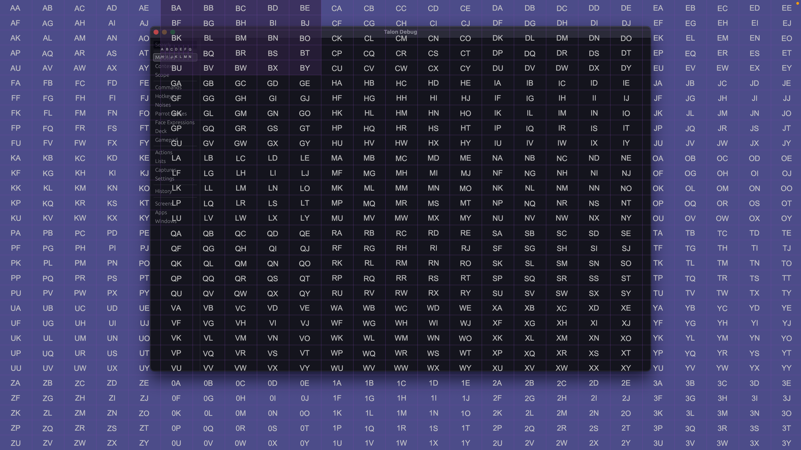

# Talon Matrix Mouse: Click anywhere in three words!

Talon Matrix Mouse allows you to click anywhere on the screen with three words by dividing the screen into a multilayered grid:



## Installation

### MacOS & Linux

```
git clone https://github.com/antman261/talon-matrix-mouse.git ~/.talon/user/matrix-mouse
```

### Windows

```
cd %AppData%\Talon\user
git clone https://github.com/antman261/talon-matrix-mouse.git matrix-mouse
```

## Usage

**_Tip!_**: Hide the matrix overlay at any time by uttering `clear`

### Step by Step Activation

1. `matrix show`: Display the matrix overlay
1. `<letter>`: Utter an alphabet word to activate a zone
2. `<letter>`: Utter another alphabet word to activate a cell in that zone
3. `<letter>`: Utter another alphabet word to click the centre of the sub-cell grid.

An example would be `matrix show`, `air`, `bob`, `drum` which would click near the top left of the screen.

Optionally, utter `right <letter>` in the final step to right click.

### Shortcut Activation

The above sequence is useful while learning the matrix, but the real power comes from using shortcuts to matrix mouse quickly!

For example:

1. `matrix (<user.letters> | <user.number_key>)`: Target any zone, cell, or sub-cell before displaying the matrix
2. `<letter>`: Utter an alphabet word to activate a cell or sub-cell, whichever is next in the process

Then the previous example could become `matrix air`, `bob`, `drum` to click the same spot. 

You can also specify a specific cell immediately by supplying two letters: `matrix air bob` or skip the matrix entirely by supplying the full three word address of a sub-cell: `matrix air bob drum`

This also works with right clicking: `matrix right air bob drum`

### Gaze Activation

You can also use matrix mouse with eye tracking to quickly refine your mouse position and click targets. For example, `matrix look zone` will activate the zone closest to where you are looking. This works if "Control Mouse" AND "Gaze Control" is on, or it works if "Always On" is on in the eye tracking menu.

## Upcoming Features & Improvements

* Customizable Styling: User defined settings controlling colors and transparency
* Dragging: Start and stop dragging actions
* Modifier clicking: Left click, right click, or drag with keyboard modifiers such as shift